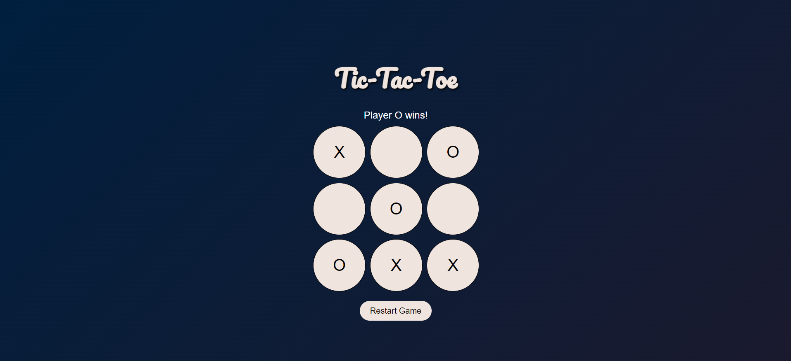

# Tic-Tac-Toe Web Application

## Project Description

This project is a web-based Tic-Tac-Toe game developed using HTML, CSS, and JavaScript. The game allows two players to play against each other, aiming to get three markers (X or O) in a row to win the game. The application features an attractive user interface with a gradient navy blue background, rounded cells, and smooth button animations.

## Features

- Interactive Tic-Tac-Toe game board
- Player turn display
- Winning and draw detection
- Restart game functionality
- Aesthetic design with gradient background and rounded cells

## Technologies Used

- HTML
- CSS
- JavaScript

## Screenshots

## How to Play

1. The game starts with Player X.
2. Players take turns clicking on empty cells to place their markers (X or O).
3. The game checks for a win or draw condition after each move.
4. If a player wins, a message displays the winner.
5. If all cells are filled without a winner, the game ends in a draw.
6. Click the "Restart Game" button to reset the game board and start a new game.

## Acknowledgements

- Thanks to Prodigy Infotech for the internship opportunity and support.
- Inspired by various online Tic-Tac-Toe implementations and design resources.
